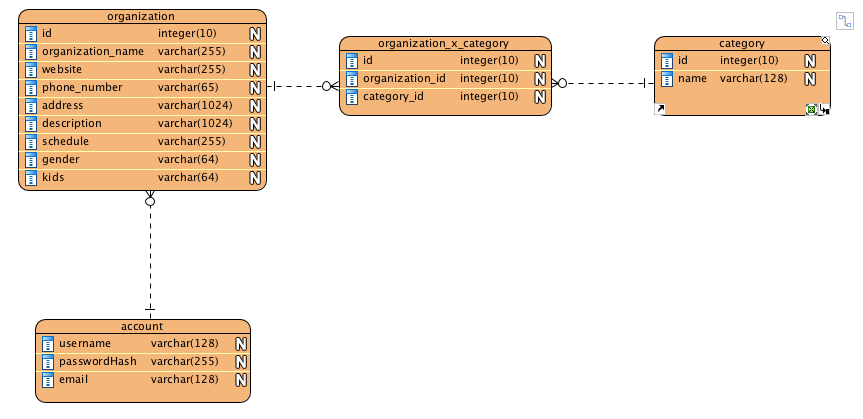

# [Emerald City Resource Guide](http://www.emeraldcityresourceguide.org/)

The Emerald City Resource Guide (ECRG [http://www.emeraldcityresourceguide.org/](http://www.emeraldcityresourceguide.org/)) is a directory of social service organizations located in Seattle.  The first hard copy of the guide was published by local non-profit, [Real Change] (https://www.realchangenews.org/), in April, 2018, in the hopes of providing an easy reference guide for individuals who may not have access to a computer. v1 of the online version of the guide was released in January, 2019, with the intention of providing the means for the guide's data to be updated on a more frequent basis and a friendly UI for those with access to the internet.

## Getting Started
To run this application on your local machine, you will need to set up a local relational database, install the necessary dependencies, and set up your own environmental variables file.

### Database
This app was originally set up using Postgres with the following data model:

A static version of the data can be found in the following csv files for local testing:
- [organization table](https://github.com/eckermania/emerald-city-resource-guide/blob/master/organization.csv)
- [category table](https://github.com/eckermania/emerald-city-resource-guide/blob/master/category.csv)
- [organization_x_category table](https://github.com/eckermania/emerald-city-resource-guide/blob/master/organization_x_category.csv)

These csv files can be used to populate your local database:
1. Create your database - within Postgres: 'CREATE <database_name>;'
2. Create schema - load table schema within the root file in the CLI with 'psql -d <database_name> -f guide.sql'
3. Populate tables - load table contents with csv data from within the root file in the CLI using 'psql -d <database_name> -f load.sql'

## Dependencies
From within the CLI, install the following npms:

- dotenv
- ejs
- express
- nodemailer
- nodemon
- pg

### Environmental Variables
Within your .env file, you must declare the following variables:
- DATABASE_URL - the url for your local database (e.g. postgres://localhost:5432/DATABASE_NAME)
- PORT - the port you'll use to run the app locally (e.g. 8080)
- GMAIL_USER - the email address that will send the emails using Nodemailer (e.g. NAME@gmail.com)
- GMAIL_PASS - the password for the email address listed above

## Upcoming Features
- Print button to print search results to PDF (ETA 4/26/19)
- Admin login to allow Real Change staff to update or delete records in the database (ETA 5/24/19)

## Built With
- Node.js
- Express web application framework
- Embedded JavaScript Templates (EJS)
- Postgres database
- Nodemailer server-side email 

## Author
Erin Eckerman - [https://www.linkedin.com/in/erineckerman/](https://www.linkedin.com/in/erineckerman/)

## License
This project is licensed under the MIT License - see the [LICENSE.md](https://github.com/eckermania/emerald-city-resource-guide/blob/master/LICENSE) for details.

## Acknowledgements

Gratitude to both Katie Comboy and Camilla Walter at Real Change for their partnership throughout the design and testing process.  Thanks to Vinicio Sanchez for his input in designing the data model.  Extra big thanks to Bogdan Gheorghe for his countless code reviews and assistance in debugging.
